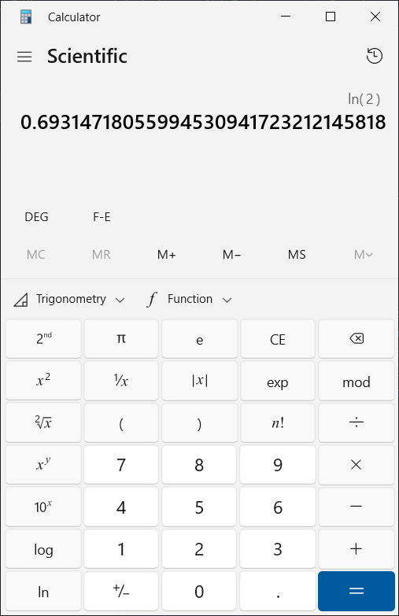

<!---
Summer of Math Exposition 3
How does a computer/calculator compute logarithms?

Author:  Zach Chartrand
Created on 2 July 2023
-->
<head>
  <link rel="stylesheet" href="https://cdn.jsdelivr.net/npm/katex@0.10.2/dist/katex.min.css" integrity="sha384-yFRtMMDnQtDRO8rLpMIKrtPCD5jdktao2TV19YiZYWMDkUR5GQZR/NOVTdquEx1j" crossorigin="anonymous">
  
  
</head>

# How does a computer/calculator compute logarithms?

## The curious student's frustration
There are many functions on a scientific or graphing calculator that we are
introduced to as high school students that, we are told, just work.  You select
the function, put in the value that you need to calculate, hit "=" or "ENTER",
and SHABAM!  You have the correct answer to some arbitrary number of digits that
you are ensured are all 100% accurate.

*Pictured:  The natural log of 2 to (an arbitrary) 32 digits on the built-in Microsoft calculator.*

This is wonderful!  Necessary, even, for if our calculators and computers calculated
logarithms inaccurately, as well as exponentials, trig functions, and square roots,
to name but a few, a lot of scientific and engineering work would be broken and
end in catastrophe.  But how do we know that the value on the calculator is, in fact,
accurate?  How did the calculator crunch the input number and give us the output?  
I remember this question being asked in high school, and the answer being no more than
a handwave.  To be fair to Algebra II teachers (which is where I was first introduced
to logarithms, if memory serves), the answer is beyond the scope of algebra, and lies in
calculus.  But it is an answer worth knowing, and it's an answer that is very
knowable, even if you don't have a background in calculus.  Calculus is the method
for deriving the formula used in calculators and computers, but the formula itself
is a pretty simple polynomial.

## The Geometric Series
Most of us were introduced to polynomial equations in algebra.  For a quick refresher, a
polynomial is an expression involving at least one variable (usually $x$) and addition,
subtraction, multiplication, division, and integer power operators.  Here are a few examples:

[Line](https://www.desmos.com/calculator/ikej8uzn59):    $y = 5 + 2x$

[Parabola](https://www.desmos.com/calculator/9ewvtz1lm6):    $y = 1 - x - x^{2}$

[Quartic](https://www.desmos.com/calculator/6dukowuqg0):    $y = 4 - 2x - 5x^{2} + \frac{1}{2}x^{3} + x^{4}$

*Note:  The links lead to Desmos graphs where you can change the parameters to see how it changes the graph.*

While these equations of polynomials contain a *finite* number of terms, we can have polynomials
with an *infinite* number of terms.  These are called **series**, and one of the simplest types of
series is called a **geometric series**.  A geometric series contains an initial term, usually
denoted by the variable $a$, and each successive term is multiplied by a ratio, usually denoted by
the variable $r$.  Here are a couple of examples:

$$ \sum_{n=1}^{\infty} \frac{1}{2^n} = \frac{1}{2} + \frac{1}{4} + \frac{1}{8} + \ldots $$

$$ \sum_{n=0}^{\infty} 2 \cdot (-3)^n = 2 - 6 + 18 - 54 + \ldots $$

In the first series, the initial value is $\frac{1}{2}$, and each term after it is the
previous term multiplied by $\frac{1}{2}$.  The second series begins with the number 2,
and each term after it is the previous term multiplied by -3.  Because the first series'
terms get smaller in absolute value for each successive term, the sum approaches, or
**converges**, to a value.  The second series' terms get larger in absolute value
with each successive term, so the series **diverges** without resolving to a defined value.

The general formula for a geometric series is

$$\sum_{n=0}^{\infty} ar^n = a + ar + ar^2 + \ldots + ar^n + \ldots$$

If we set this formula equal to $s$, we can do some rearranging to find a function that
this series is equivalent to:

$$s = a + ar + ar^2 + \ldots + ar^n + \ldots$$

By pulling an $r$ out of all the terms after the first one, we get

$$s = a + r(a + ar + ar^2 + \ldots + ar^{n-1} + \ldots)$$

Despite the fact that $ar^n$ becomes $ar^{n-1}$, we have an infinite number of terms,
so if we were to expand out the terms in the parentheses, we get the same series as $s$
in the first line; therefore, we can substitute the terms in the parentheses with $s$!

$$s = a + rs$$

Move $rs$ to the left side of the equation:

$$s - rs = a,$$

combine like-terms:

$$s(1 - r) = a,$$

and solve for $s$:

$$s = \frac{a}{1 - r}.$$

We can now set both $s$ expressions equal to each other:

$$\frac{a}{1 - r} = \sum_{n=0}^{\infty} ar^n = a + ar + ar^2 + \ldots + ar^n + \ldots$$

Note that this assumes the series converges.  This formula does not hold if the
series diverges.

The geometric series we are interested in regarding the logarithm is the one where $a = 1$
and $r = -x$:

$$\frac{1}{1-(-x)} = 1 + (-x) + (-x)^2 + (-x)^3 + \ldots + (-x)^n + \ldots$$

$$\frac{1}{1+x} = 1 - x + x^2 - x^3 + x^4 + \ldots + (-x)^n + \ldots$$

This series converges when $|x| < 1$.  Now, you might think that some of the algebraic
manipulation we did earlier was invalid, but we can check our work.  Below, I have a Desmos
graph with both the function $\frac{1}{1+x}$ and the infinite series.  By moving the slider for $N$,
you can add successive terms to the series and see that, as more and more terms are added,
the series graph becomes a better and better approximation to the function graph for $|x| < 1$.

[Desmos: Geometric Series](https://www.desmos.com/calculator/t6u3zwhabp)

## Getting a series for the natural logarithm

"This is all very interesting, but what does this have to do with computing logarithms?"

It turns out that the function $\frac{1}{1+x}$ and the natural logarithm are directly related.
Specifically, the area under the curve $\frac{1}{1+t}$ from $t = 0$ to any value $x$ is the
natural logarithm of $1+x$.  In mathematical symbols, this is rendered as

$$\int_{0}^{x} \frac{1}{1+t} dt = \ln{(1+x)}$$

While the understanding of the calculus involved is beyond the scope of this article,
I made a [Desmos graph](https://www.desmos.com/calculator/czktma6spu) where you can play
with values of $x$ ($a$ in the graph) and see the area under the curve, with its exact
value shown and a 1x1 square area shown as a comparison.

Taking integrals is an inverse problem and for some functions is very difficult, if not impossible, to get the exact solution.
However, for polynomials, it's actually very easy.  For a given polynomial term, increase the degree
by one, divide the term by the new degree, and take the difference of the function evaluated at the two
integrand values (the values at the top and bottom of the $\int$ ).

We'll start by setting the natural logarithm equal to the integral of our geometric series:

$$\ln{(1+x)} = \int_{0}^{x} \frac{1}{1+t} dt = \int_{0}^{x} (1 - t + t^2 - t^3 + t^4 + \ldots + (-t)^n + \ldots) dt$$

The integral of a sum is the sum of the integrals of each term, so we can take this one term at a time.
Starting with the first term,

$$ \int_{0}^{x} 1 dt = \int_{0}^{x} 1t^0 dt = \frac{t^{0+1}}{0+1} \Big|_0^x = \frac{t^1}{1} \Big|_0^x = t \Big|_0^x = x - 0 = x$$

Let me explain the symbols above.  We start with taking the integral of 1, a constant, in terms of $t$
(which is a dummy variable to distinguish it from $x$ in the answer).  A constant can be represented as
a zero-degree polynomial term, so we can represent 1 as 1 times $t^0$.  We add one to the degree, so 0
becomes 1, then we divide by the new degree, which is 1 in this case.  Our result is $t$.  We then need to
evaluate this term at $t = x$ and $t = 0$ and subtract them (this is what the vertical bar represents).
The result is $x - 0$, which reduces to $x$.  So the first term of our infinite series for
$\ln{(1+x)}$ is $x$!  Let's do the second term:

$$ \int_{0}^{x} -t dt = \int_{0}^{x} -t^1 dt = -\frac{t^{1+1}}{1+1} \Big|_0^x = -\frac{t^2}{2} \Big|_0^x = -\frac{x^2}{2} - \biggl(-\frac{0^2}{2} \biggr) = -\frac{x^2}{2} + 0 = -\frac{x^2}{2}$$

Our second term is $-\frac{x^2}{2}$.  You may start to see the overall pattern, but we'll do one more:

$$ \int_{0}^{x} t^2 dt = \frac{t^{2+1}}{2+1} \Big|_0^x = \frac{t^3}{3} \Big|_0^x = \frac{x^3}{3} - \frac{0^3}{3} = \frac{x^3}{3} $$

With this, the pattern starts to come into focus.  We have a series where each term is a polynomial
divided by its degree, where all of the odd degree polynomial terms are positive and all the even
terms are negative.  Written as a series,

$$ \ln{(1+x)} = \sum_{n=0}^{\infty} (-1)^n \frac{x^{n+1}}{n+1} = x - \frac{x^2}{2} + \frac{x^3}{3} - \frac{x^4}{4} + \ldots $$

In fact, if we were to integrate the general term of the geometric series, this is exactly what we get:

$$ \int_0^x \frac{1}{1+t} dt = \int_0^x \sum_{n=0}^{\infty} (-t)^n dt $$

$$ = \sum_{n=0}^\infty \biggl( \int_0^x (-t)^n dt \biggr) $$

$$ = \sum_{n=0}^\infty \biggl( \int_0^x (-1)^n t^n dt \biggr) $$

$$ = \Biggl( \sum_{n=0}^\infty (-1)^n \frac{t^{n+1}}{n+1} \Biggr) \Bigg|_0^x $$

$$ = \sum_{n=0}^{\infty} (-1)^n \frac{x^{n+1}}{n+1} $$

So, we did it!  We have a polynomial series that calculates the natural logarithm!  Granted, we need to shift our
input by 1, as this series is $\ln{(1+x)}$, but that's a simple hurdle to jump!

Except we're limited.  Very limited.  Remember, the geometric series only applies to the function $\frac{1}{1+x}$ for
$|x| < 1$, otherwise it diverges.  The same limitation exists here.  What's worse, the series only converges quickly
for $|x| < \frac{1}{2}$; outside this range, the number of terms becomes too much even for a computer to calculate in
a reasonable amount of time. This is fine if all the values you need to calculate a logarithm for are between 0.5 and 1.5,
but most problems involving logarithms tend to have very large values.

Well, we tried.  Pack up, go home, see you next time.

## Properties of logarithms

Actually, as it turns out, this *would* be the end if we were dealing with almost any other function.
But we are dealing with logarithms, and logarithms are special.  There are two properties that we
can use to reduce our inputs so that we can calculate the logarithm of any value we want!

The first property is that *multiplication in the input is equivalent to addition of the outputs*.

This means that if the input is the product of two factors, the logarithm of that product is the same
as the logarithms of each factor taken individually and added together.  For example, if we wanted to
find the natural logarithm of the value 6, we can compute either $\ln(6)$ or $\ln(2) + \ln(3)$, because
$6 = 2 \cdot 3$.

The general form of this property is

$$ \log_b{(ac)} = \log_b{(a)} + \log_b{(c)} $$

This also applies to division in the inputs, but instead, you subtract the outputs:

$$ \log_b{ \Bigl( \frac{a}{c} \Bigr) } = \log_b{(a)} - \log_b{(c)} $$

The second property is that *the logarithm of a value raised to some power is that power times the
logarithm of the (unraised) value*.

This means that exponents in the input of the logarithm can hop out and
become a coefficient in the output. For example, the number 8 can also be written as
$2^3$ $(2 \cdot 2 \cdot 2 = 8)$, so $\ln(8) = \ln(2^3) = 3\ln(2)$.

The general form of this property is

$$ \log_b{(a^c)} = c \log_b{(a)} $$

Each of these properties allow us to reduce the argument of the logarithm in different ways. Using the
first property, if we have the natural logarithm of a known value (2 and 10 are common choices), we can
reduce the argument by powers of that constant until we get a small enough input. Let's use 15 as an
example. If we have the natural logarithm of 2 calculated, we can keep dividing 15 by 2 until it is close
to 1 while keeping track of the number of times we divided by 2. After dividing by 2 four times,
we reduce 15 to 0.9375, so $0.9375 \cdot 2^4 = 15$. We can plug this value into our series like this:

$$ \ln(15) = \ln(2^4 \cdot 0.9375) = 4 \ln(2) + \ln(0.9375) $$

$$ = 4 \ln(2) + \ln(1 + (0.9375 - 1)) = 4 \ln(2) + \ln(1 + (-0.0625)) $$

$$ = 4 \ln(2) + (-0.0625) - \frac{(-0.0625)^2}{2} + \frac{(-0.0625)^3}{3} + \ldots $$

$$ = 2.772588722239781... - 0.0625 - 0.001953125 - 0.000081380208333... + \ldots $$

We can see that as terms are added to the series, the approximation gets more and more precise as
each term gets smaller and smaller in magnitude.  In this particular example, the next term is
less than one tenth the absolute value of the previous term. This means that the approximation gains
about one digit of accuracy for each term we add to the series. To see this, here is a list of the
first eight approximations for $\ln(15)$, as well as the accepted value:

0 terms: 2.772588722239781  
1 term:  2.710088722239781  
2 terms: 2.708135597239781  
3 terms: 2.708054217031448  
4 terms: 2.708050402334182  
5 terms: 2.708050211599319  
6 terms: 2.708050201665211  
7 terms: 2.708050201133027  
8 terms: 2.708050201103923

Accepted value: 2.708050201102210

So now we have a formula for finding the natural logarithm of any number to arbitrary precision
based on the number of terms we use in the series. We did it! I even have a [Python script](scripts/log.py)
that implements this formula to return the natural logarithm of any value within 64-bit floating-point
precision using 48 terms.

Now, this formula is perfectly good to use. After all, it's the formula used in
[Python's decimal module](https://github.com/python/cpython/blob/main/Lib/_pydecimal.py#L5738)
to find the natural logarithm for base-10 number representation. But what if there were a better
formula? One that converged much faster to find the natural logarithm with fewer terms?

## The better formula

How can an infinite series converge faster? Well, it turns out that for inputs less than 1, series
that have terms that increase by two degrees will converge much faster than series that only increase
by one. For example, if you look at the series for
[sine and cosine](https://en.wikipedia.org/wiki/Sine_and_cosine#Series_definitions),
they increase in degree by 2 for each term and converge very quickly (in fact, if you look at the C
implementations of the
[sine kernel](https://github.com/freemint/fdlibm/blob/master/k_sin.c) and
[cosine kernel](https://github.com/freemint/fdlibm/blob/master/k_cos.c), they only use six
polynomial terms to get double floating-point precision, a much quicker convergence than our 48 terms!).
So how do we get this series to skip a degree for each term? Surely, we can't just get rid of all the
even-degree terms or all of the odd-degree terms and still get an accurate answer, right?

We can if we do it in a clever way. Let's look at the series again:

$$ \ln{(1+x)} = \sum_{n=0}^{\infty} (-1)^n \frac{x^{n+1}}{n+1} = x - \frac{x^2}{2} + \frac{x^3}{3} - \frac{x^4}{4} + \ldots $$

This is the series for $\ln{(1+x)}$, but what if we could get a series for a slightly different input? For instance,
what would the series be for $\ln{(1-x)}$? We can rewrite $\ln{(1-x)}$ as $\ln{(1 + (-x)}$. To get its series, let's plug (-x)
into our natural log series:

$$ \ln{(1-x)} = \ln{(1 + (-x)} = (-x) - \frac{(-x)^2}{2} + \frac{(-x)^3}{3} - \frac{(-x)^4}{4} - \ldots $$

$$ \ln{(1-x)} = -x - \frac{x^2}{2} - \frac{x^3}{3} - \frac{x^4}{4} + \ldots = \sum_{n=0}^{\infty} -\frac{x^{n+1}}{n+1} $$

The difference between this series and our original series is that all the odd terms have become negative
while the even terms remain negative. This is perfect! If you don't understand why, let me put each series in
expanded form with all the terms lined up:

$$ \ln{(1+x)} = +x - \frac{x^2}{2} + \frac{x^3}{3} - \frac{x^4}{4} + \frac{x^5}{5} - \frac{x^6}{6} + \ldots $$

$$ \ln{(1-x)} = -x - \frac{x^2}{2} - \frac{x^3}{3} - \frac{x^4}{4} - \frac{x^5}{5} - \frac{x^6}{6} - \ldots $$

It should be apparent from this form that if we add the two series together, the odd terms will cancel out,
and if we subtract the second series from the first series, the even terms will cancel out. So, should we add
the series together, or subtract them? This must be determined by seeing how the logarithm function input changes
when we add or subtract the two functions together. If we add the two functions together, we get

$$ \ln{(1+x)} + \ln{(1-x)} = \ln{((1+x)(1-x))} = \ln{(1-x^2)} $$

And if we subtract the two functions, we get

$$ \ln{(1+x)} - \ln{(1-x)} = \ln{ \biggl( \frac{1+x}{1-x} \biggr)} $$

using the first property of logarithms. Let's remind ourselves that $x$ is the value we plug into the
series. If we want the natural logarithm of some value, let's call it $u$, then we have to find the
value of $x$ to plug into our series that will get us the natural log of $u$. We can find this by
setting $u$ equal to the input of each new, combined logarithm and solve for $x$. For the added
logarithm, set $u$ equal to $1 - x^2$:

$$ u = 1 - x^2 $$

$$ x^2 = 1 - u $$

$$ x = \sqrt{1-u} $$

For the subtracted logarithm, set $u$ equal to $\frac{1+x}{1-x}$:

$$ u = \frac{1+x}{1-x} $$

$$ u(1-x) = 1 + x $$

$$ u - ux = 1 + x $$

$$ u - 1 = ux + x $$

$$ ux + x = u - 1 $$

$$ x(u + 1) = u - 1 $$

$$ x = \frac{u-1}{u+1} $$

The addition of the logarithms requires taking a square root to convert our main input into the series input, while the
subtraction of the logarithms only requires addition, subtraction, and division. Subtracting the logarithms is
the clear winner. Now we can take our two series and combine them in this manner:

$$ \ln{(1+x)} = x - \frac{x^2}{2} + \frac{x^3}{3} - \frac{x^4}{4} + \frac{x^5}{5} - \frac{x^6}{6} + \ldots $$

$$ -\ln{(1-x)} = -(-x - \frac{x^2}{2} - \frac{x^3}{3} - \frac{x^4}{4} - \frac{x^5}{5} - \frac{x^6}{6} - \ldots) $$

Distributing the negative sign on the second series, we get

$$ \ln{(1+x)} = x - \frac{x^2}{2} + \frac{x^3}{3} - \frac{x^4}{4} + \frac{x^5}{5} - \frac{x^6}{6} + \ldots $$

$$ -\ln{(1-x)} = x + \frac{x^2}{2} + \frac{x^3}{3} + \frac{x^4}{4} + \frac{x^5}{5} + \frac{x^6}{6} + \ldots) $$

$$ \ln{ \biggl( \frac{1+x}{1-x} \biggr)} = 2x + \frac{2}{3}x^3 + \frac{2}{5}x^5 + \frac{2}{7}x^7 + \ldots $$

$$ \ln{ \biggl( \frac{1+x}{1-x} \biggr)} = \sum_{n=0}^{\infty} \frac{2}{2n+1}x^{2n+1} $$

Substituting our initial value, $u$, in, we get

$$ \ln{(u)} = \sum_{n=0}^{\infty} \frac{2}{2n+1} {\biggl( \frac{u-1}{u+1} \biggr)}^{2n+1} = 2{\biggl( \frac{u-1}{u+1} \biggr)} + \frac{2}{3} {\biggl( \frac{u-1}{u+1} \biggr)}^3 + \frac{2}{5} {\biggl( \frac{u-1}{u+1} \biggr)}^5 + \frac{2}{7} {\biggl( \frac{u-1}{u+1} \biggr)}^7 + \ldots $$

We now have a series that increases by two degrees for each new term added! But how much quicker does
this series converge compared to our old series? I have made a
[Desmos graph](https://www.desmos.com/calculator/zr1vhmoign) where you can compare the two series.
The series for $\ln{(1+x)}$ is in red and our new series is in green. Slide the value for N to add terms
to the series approximations, and note how they converge both by looking at the graph and by looking at
the calculation for the natural log of 2. (Also, notice the difference in the radius of convergence.)
The old series takes 36 terms to reach Desmos' calculator
accuracy (11 decimal places), but the new series only takes 12! We reduced the number of terms we need
by one third! And when you have the option to reduce the argument like we did with the example to find
the natural log of 15, the number of terms reduces further. In my
[Python script for the new series](scripts/log_fast.py), the code calculates the natural logarithm
for any number with 15 terms, less than one third of the 48 terms needed for my script for the
other series! This series is what is used in the
[logarithm function used in the C library](https://github.com/freemint/fdlibm/blob/master/e_log.c),
which was made during a time where memory was much more limited, so optimization was much more
necessary than it is today; it only uses 8 terms of the series after optimizing the argument
reduction algorithm to get an answer accurate to double floating-point precision.

But it doesn't matter which series you use. With either one, you now understand how your computer
and your calculator compute and give you an accurate value to the natural logarithm function. And
with the [change of base formula](https://en.wikipedia.org/wiki/Logarithm#Change_of_base), you can
calculate the logarithm of any base.

## Final thoughts

As I was learning how to script in Python, I began to get curious about how things worked under the
hood of this programming language. Since Python is open source, I was able to look at its source code
to see how different mathematical functions, particularly in its
[math](https://docs.python.org/3/library/math.html) and
[cmath](https://docs.python.org/3/library/cmath.html) modules, worked and how their code was structured.
I learned about different techniques of coding mathematical formulae that avoided weird edge cases that
would either create an inaccurate result or throw an error despite a calculable value existing.
However, when it came to the basic complicated math functions, like the logarithm, trigonometric, and
exponential functions, I found that the Python source code didn't have them written up, because Python
used the functions from the C library. This led me to a new adventure where I looked into [the original
C code](https://github.com/freemint/fdlibm), which, while more difficult to read, is surprisingly
readable once you have learned Python.
The trig functions worked more or less how I expected, but I was surprised that the natural logarithm
used a different series than the one I had learned about in my calculus class. (So does the exponential
function, incidentally. After all, the Taylor series for exp(x) only increases by one degree each term,
and as we've learned here, if you can bump that up to two degrees per term, you have better optimization.
If you are curious, go and seek that one out yourself.) Once I worked out how this series was derived,
I gained an appreciation for the cleverness of mathematicians and programmers who sussed out this series
to calculate values for this very useful function. I have always been interested in how things like this
work; when I was younger, I was the curious student who got frustrated when something logical and
grounded in structured patterns was given to us like a magic wand where one push of a button gave you
the answer you sought. I saw logarithm tables that had painstaking calculations for every common logarithm
between 1.000 and 10.000 in 0.001 increments. Where did these values come from, and how do we know they
work for our calculations of radioactive decay, chemical reactions, and population growth? Thanks to this
exercise, now I know, and if you made it this far, so do you! Thank you for joining me on this fun little
math adventure. I hope you found this exercise as interesting and enlightening as I have.
